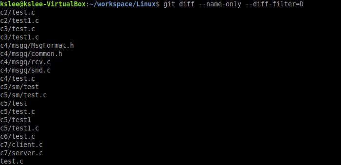
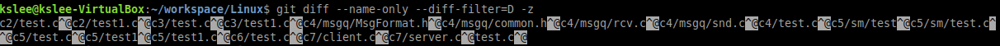
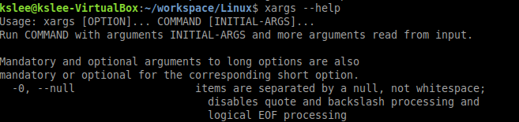
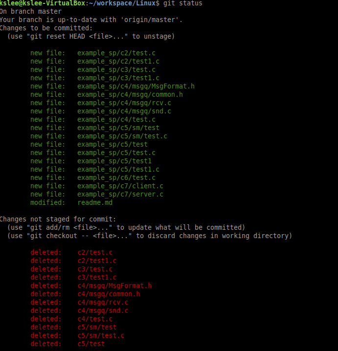
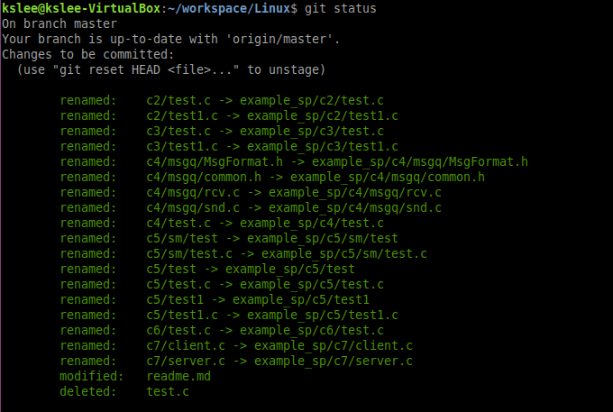

# Remove deleted files from git index 

``` 
git diff --name-only -diff-filter=D -z | xargs -0 git rm --cached
```


* git diff --name-only -diff-filter=D

  

  > display paths that have deleted or moved

* git diff --name-only -diff-filter=D -z



>  replace '\n' to specific character. using '-z' option, '\0' is only seperator of string.


Here's man page of git diff -z option

```
       -z
           When --raw, --numstat, --name-only or --name-status has been given,
           do not munge pathnames and use NULs as output field terminators.

           Without this option, each pathname output will have TAB, LF, double
           quotes, and backslash characters replaced with \t, \n, \", and \\,
           respectively, and the pathname will be enclosed in double quotes if
           any of those replacements occurred.
```


* xargs -0 [command]

  

> using -0 option, '\0' is only seperator of string.


* git rm --cached

  > remove files from index stage.

-----------------------------------------

## Result

> before





> after

